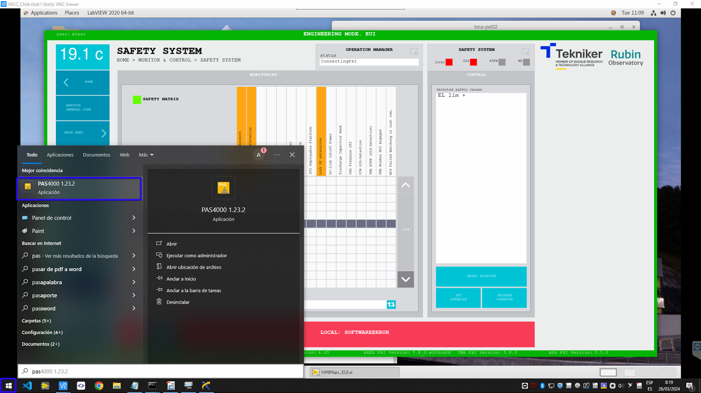
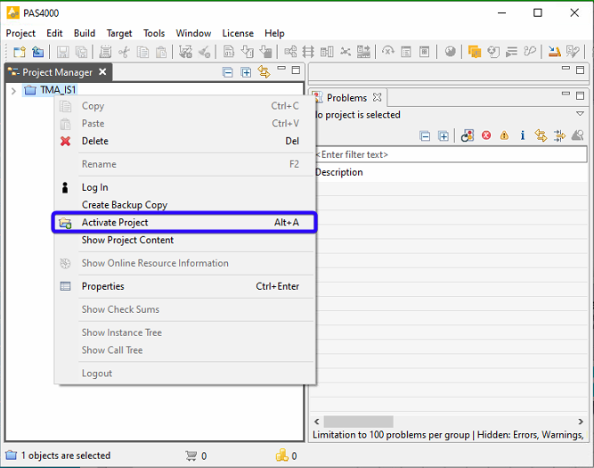
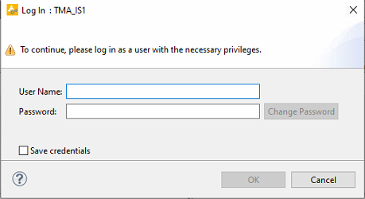
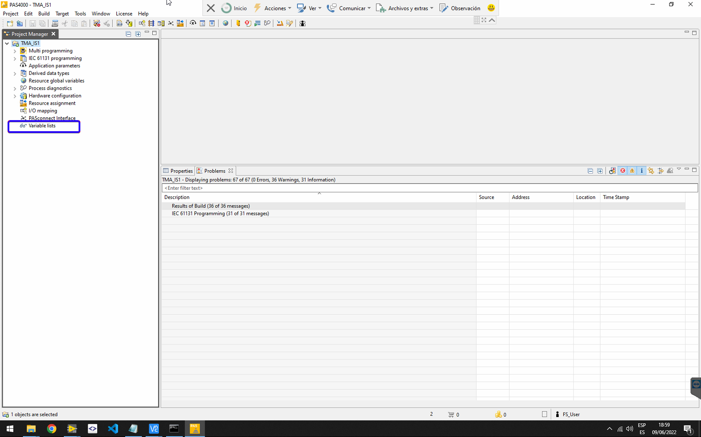
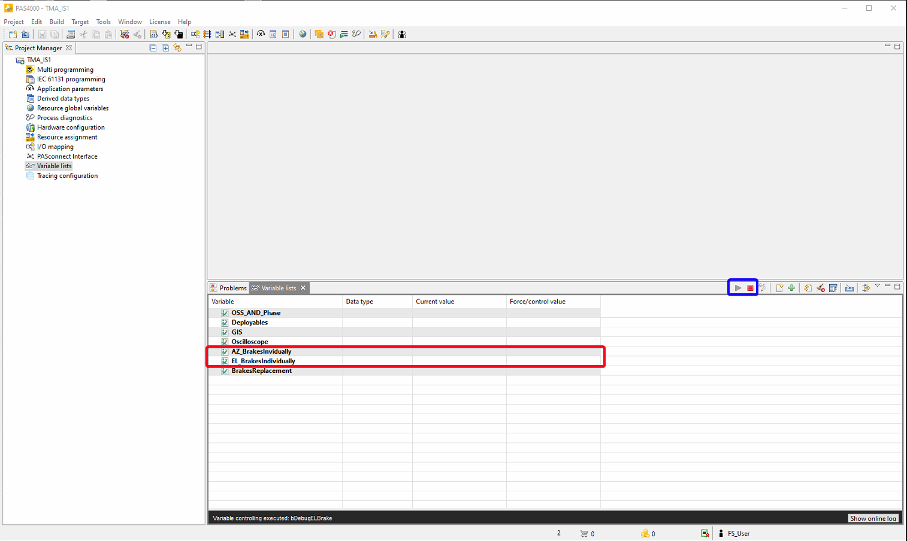
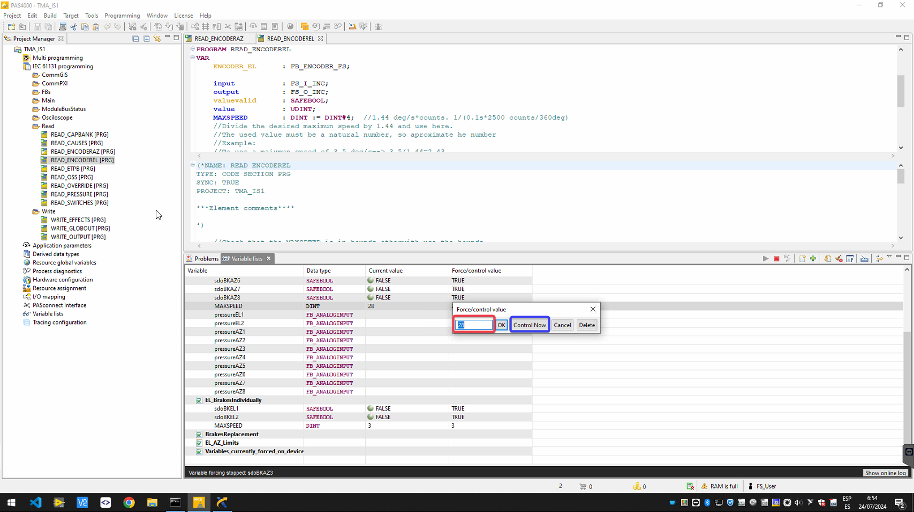
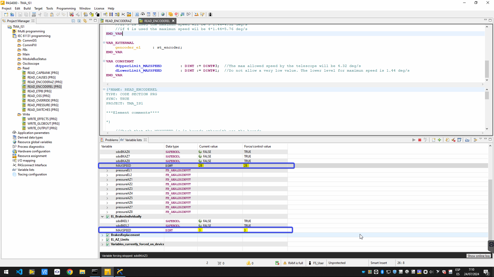

# TMA-IS Over Speed Limit Adjustment

| **Requested by:** | **AURA** |
|-------------------|----------|
| **Doc. Code**     | #{documentCode}       |
| **Editor:**       | A. Izpizua         |
| **Approved by:**  | J. García         |

## Index

- [TMA-IS Over Speed Limit Adjustment](#tma-is-over-speed-limit-adjustment)
  - [Index](#index)
  - [Introduction](#introduction)
    - [Symbols used in the Document](#symbols-used-in-the-document)
  - [General safety conditions](#general-safety-conditions)
  - [Changing the safety speed limits](#changing-the-safety-speed-limits)
    - [Speed Limit Valid Values](#speed-limit-valid-values)

## Introduction

This document shows how to change the maximun allowed speed for azimuth and elevation in the TMA IS.

### Symbols used in the Document

<table>
  <colgroup>
    <col style="width: 8%" />
    <col style="width: 91%" />
  </colgroup>
  <tbody>
    <tr class="odd">
      <td>🛑</td>
      <td>
        
<strong>DANGER</strong>

        

          DANGER SYMBOLS ARE USED TO ATTRACT ATTENTION TO ESSENTIAL OR CRITICAL
          INFORMATION. WARNINGS INCLUDE INFORMATION ON CONDITIONS, PRACTICES OR
          PROCEDURES TO BE FOLLOWED TO AVOID:
        

        <ul>
          <li>
PERSONAL INJURIES.
</li>
          <li>
LOSS OF LIFE.
</li>
        </ul>
      </td>
    </tr>
  </tbody>
</table>
<table>
  <colgroup>
    <col style="width: 8%" />
    <col style="width: 91%" />
  </colgroup>
  <tbody>
    <tr class="odd">
      <td>⚠️</td>
      <td>
        
<strong>WARNING</strong>

        

          Warning notices are used to describe the conditions, practices or
          procedures that should be followed to avoid:
        

        <ul>
          <li>
Damaging the equipment.
</li>
          <li>
Destroying the equipment.
</li>
          <li>
Endangering health in the long term.
</li>
        </ul>
      </td>
    </tr>
  </tbody>
</table>
<table>
  <colgroup>
    <col style="width: 8%" />
    <col style="width: 91%" />
  </colgroup>
  <tbody>
    <tr class="odd">
      <td>ℹ️</td>
      <td>
        
<strong>NOTE</strong>

        

          Notes are used to highlight information of particular importance or
          relative interest that:
        

        <ul>
          <li>
            
Should be remembered.

          </li>
          <li>
            
Help with correct decision-making.

          </li>
          <li>
            
Is otherwise difficult to find.

          </li>
        </ul>
      </td>
    </tr>
  </tbody>
</table>

## General safety conditions

- 🛑 **PERSONNEL THAT PROCEED WITH THIS INSTRUCTIONS MUST BE QUALIFIED OR INSTRUCTED PERSONNEL WHO HAVE BEEN GIVEN SPECIFIC TRAINING IN THE USE OF THE PAS4000 SOFTWARE AND THE PROCEDURES DESCRIBED IN THIS DOCUMENT, INCLUDING ITS HAZARDS, THE SAFETY MEASURES TO BE TAKEN AND OBSERVED, AS WELL AS THE PERSONAL PROTECTIVE EQUIPMENT TO BE USED AND THE ACTIONS THAT MUST NOT BE CARRIED OUT.**
- 🛑 **PERSONNEL USING THIS SOFTWARE MUST BE AWARE OF EACH AND EVERY RISK ASSOCIATED WITH EACH ACTION.**
- 🛑 **BEFORE PERFORMING ANY ACTION TAKE THE NECESSARY SAFETY ACTIONS TO MANTEIN PEOPLE, INSTRUMENTS AND TELESCOPE SAFE**

## Changing the safety speed limits

To change the safety speed limits proceed with steps.

1. Find the PAS4000 program in windows

1. Activate the TMA IS project

1. Enter credentials.                       

1. Open the "Variable Lists" item

1. The desired variable list can be opened clicking on it (red) and to start monitorin data the play button must be pressed (blue).

   1. To manage azimuth open the AZ_BrakesInividually variable list
   2. To manage elevation open the EL_BrakesInividually variable list
      

1. Find the variable to change MAXSPEED. 🛑 **THE VALUE INSERTED HERE COULD BE DANGEROUS FOR THE TELESCOPE OR FOR PEOPLE.**

1. Double click in the "Force/control value" column. Then change the value to the desired one in the red box, and click "Control Now" button (blue). Check the valid values in the table shown in [Speed Limit Valid Values](#speed-limit-valid-values) section.

  1. For azimuth each unit is equivalent to 0.36deg/s. This is a value of 10 is equal to a maximun velocity in azimuth of 3.6deg/s.
  2. For elevation each unit is equivalent to 1.44 deg/s. This is value of 2 is equal to a maximun velocity in elevaiton of 2.88 deg/s.

1. If the values are valid, the values shown in the "Current value" and "Force/control value" columns are the same. Otherwise the value will be limted to the fixed limit

### Speed Limit Valid Values

The values must be inside a range. This range was defined by AURA, but they do not ensure that the values inside this limits are totally safe for the camera. Please check the allowed maximun values in each situation

| Axis      | Velocity per unit | Allowed Max. value | Equivalent Maximum Velocity | Allowed Min. value | Equivalent Minimum Velocity |
| --------- | -------------------- | ---------------------- | ----------------------------- | ---------------------- | ---------------------------- |
| Azimuth   | 0.36 deg/s           | 28                     | 10.08 deg/s                   | 2                      | 0.72 deg/s                   |
| Elevation | 1.44 deg/s           | 4                      | 5.76 deg/s                    | 1                      | 1.44 deg/s                   |